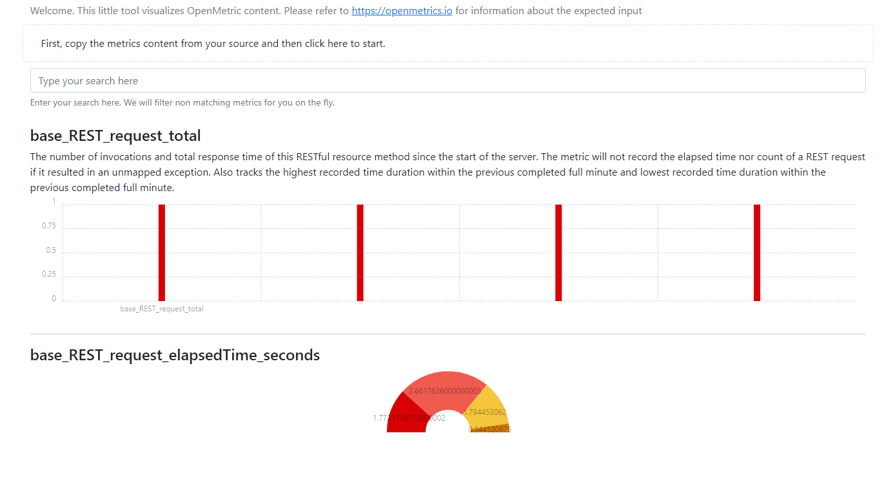

# openmetricsviz

A tool for visualizing an openmetrics output via copy and paste

## Start (from code)

- Install golang
- Clone this repository
- Enter repository root directory
- Run: `go run ./openmetricsviz.go`
- Your default browser will open on `http://localhost:50505/` (if not, do it manually)
